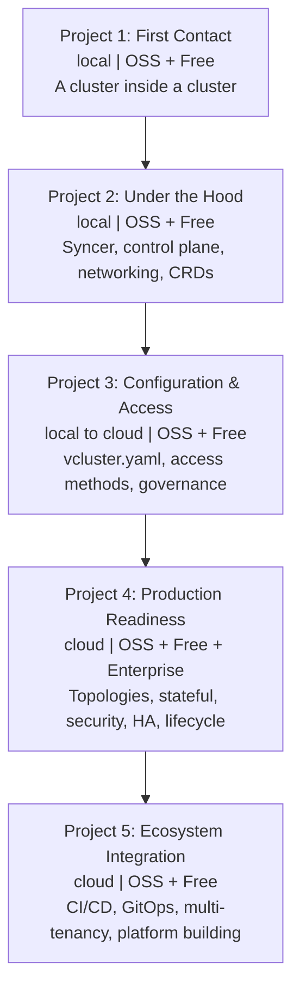

# vCluster Learning Curriculum -- Getting Started

This guide is the entry point for all learners. It describes how to set up the vCluster learning curriculum as a Notion workspace and begin working through milestones. Everyone starts here -- regardless of whether you also use Git and Claude Code.

> **Note on Git:** Git is not required to start this curriculum. However, version control is a learning objective beginning in Project 1 -- you will be expected to adopt it as part of the curriculum, not as a prerequisite.

---

## Before You Start

### Required Tools

Install these before beginning Project 1:

| Tool | Purpose | Required by |
|------|---------|-------------|
| kubectl | Kubernetes CLI -- all cluster interaction | All projects |
| Helm v3 | Package manager -- installs vCluster and workloads | All projects |
| Docker (or compatible runtime) | Container runtime for local clusters | Projects 1-3 |
| vCluster CLI | Creates and manages virtual clusters | All projects |
| kind, k3d, or minikube | Local Kubernetes cluster | Projects 1-3 |

### Optional -- Enhanced Learning with AI Mentoring

| Tool | Purpose | Required by |
|------|---------|-------------|
| Git | Version control -- also a curriculum learning objective | Recommended from Project 1 |
| Claude Code CLI | AI-guided Socratic mentoring, automated progress tracking | Optional, all projects |

If you use Git + Claude Code, see `git_claude_workflow_guide.md` for setup instructions.

### Required Later

| Tool / Account | Purpose | Required by |
|----------------|---------|-------------|
| Cloud Kubernetes cluster (EKS, GKE, AKS, or equivalent) | Production-like environment | Projects 3-5 |
| GitHub account | CI/CD pipeline milestone | Project 5 M1 |
| loft.sh account (free tier) | vCluster Platform features | Any `[Free]` milestone |

### What You Can Skip

- **OSS-only track:** If you do not create a loft.sh account, skip milestones tagged `[Free]`: P1-M2, P2-M4, P3-M3, P4-M1 (partial), P5-M3. The remaining milestones form a complete OSS-only path.
- **Local-only track:** If you do not have cloud access, Projects 1-2 and P3-M1 are fully local. You will need cloud access starting at P3-M2.
- **P4-M5 (Lifecycle Management)** is optional -- it requires Enterprise tier features.

---

## Tooling Paths

The curriculum itself does not fork -- all learners work through the same milestones, requirements, and pressures. Only the workflow differs.

### Path 1: Notion Only

You work entirely from Notion. Progress is tracked in the Milestones database. Reflection prompts are built into each milestone page template. This is the default path and requires no additional setup beyond the tools listed above.

### Path 2: Notion + Git + Claude Code

You also clone the curriculum repository and use Claude Code as an AI mentor alongside your Notion workspace. This path adds:

- **Socratic mentoring** -- Claude Code asks guiding questions instead of giving answers, calibrated to your demonstrated skill level. This supplements the static reflection prompts in the Notion milestone pages with interactive, adaptive questioning.
- **Automated progress tracking** -- Claude Code maintains `LEARNER_STATE.md` in the repo, recording your concept proficiency, scaffolding levels, and self-assessments. This supplements (not replaces) the Notion Milestones database status tracking.
- **Commit workflow** -- structured Git operations through Claude Code's `/commit` command.
- **Session continuity** -- Claude Code reads your state at the start of each session and resumes where you left off.

Both paths use the same Notion workspace described below. Git + Claude Code is a layer on top, not a replacement. See `git_claude_workflow_guide.md` for setup.

> **Which path should I choose?** If you are comfortable with the command line and want adaptive AI mentoring, use Path 2. If you prefer a self-directed approach or are not yet comfortable with Git, start with Path 1 -- you can add Git + Claude Code at any time.

---

## Notion Page Structure

Build your curriculum workspace with the following pages and databases. Each section below describes what to create and what content to put in it.

---

### 1. Home Page

Create a top-level page titled **vCluster Learning Curriculum**.

Add the following content:

---

#### How to Use This Curriculum

**Problem-first philosophy.** Milestones describe what your system must *do*, not how to build it. Read the full milestone chain for a project before starting any single milestone -- later milestones often invalidate the naive approach from earlier ones.

**"Pressure you'll feel"** sections are the pedagogical core. They name the concept you are meant to struggle with. Sit with the friction before looking for answers.

**"Lifecycle pressure"** blocks surface version control, Infrastructure as Code, and testing questions at the moment they become real -- not before. They ask questions; they do not issue commands.

#### How to Navigate

- The **Roadmap** page provides a visual overview of all projects and milestones
- The **Milestones** database is where you do your work -- one entry per milestone with requirements, pressures, and your notes
- The **Projects** database shows your overall progress per project
- The **Resources** database collects all external documentation links
- The **Glossary** page defines key vCluster terms
- Use the **Progress Dashboard** views to see where you are at a glance

#### Tier System

| Tag | Meaning |
|-----|---------|
| OSS | vCluster open-source CLI only (no platform account needed) |
| Free | vCluster Platform free tier (loft.sh account required) |
| Optional -- Enterprise | Enterprise features (trial or licensed); optional bonus content |

---

### 2. Roadmap Page

Create a subpage titled **Roadmap**.

#### Curriculum Flow

| Order | Project | Focus | Environment | Tiers |
|-------|---------|-------|-------------|-------|
| 1 | First Contact | Basic lifecycle, UI, isolation | Local | OSS + Free |
| 2 | Under the Hood | Control plane, syncer, networking, CRDs | Local | OSS + Free |
| 3 | Configuration & Access | vcluster.yaml, access patterns, governance | Local to Cloud | OSS + Free |
| 4 | Production Readiness | Topologies, stateful, security, HA, lifecycle | Cloud | OSS + Free + Enterprise |
| 5 | Ecosystem Integration | CI/CD, GitOps, multi-tenancy, extensions | Cloud | OSS + Free |

Each project builds on the last. Milestones within a project must be completed in order.

#### Mermaid Diagrams (Optional)

Notion supports Mermaid in code blocks (set language to `mermaid`). If they render in your workspace, paste the diagrams below. If not, use the table above and the Milestones database as your navigation.

**Overview diagram:**



#### Lifecycle Threads

Three skill threads run parallel to the milestones. They are independent learning objectives -- you can learn vCluster without them, but production operators need all three.

| Thread | What it teaches | Where it appears |
|--------|----------------|-----------------|
| Version Control | Tracking what you configured, why, and how to reproduce it | P1-M1, P2-M3, P3-M1, P4-M4, P5-M2 |
| Infrastructure as Code | Moving from manual/UI steps to declarative, portable definitions | P1-M2, P2-M1, P2-M4, P3-M3, P4-M1, P4-M5 |
| Testing / Validation | Proving your system works -- repeatably, not just once | P1-M3, P2-M2, P3-M2, P4-M2, P4-M3, P5-M3 |

---

### 3. Milestones Database

Create an **inline database** (or full-page database) titled **Milestones**.

#### Database Properties

| Property | Type | Options / Notes |
|----------|------|-----------------|
| Title | Title | Milestone name (e.g., "M1: The Basic Lifecycle") |
| Project | Relation | Links to the Projects database |
| Milestone Number | Select | M1, M2, M3, M4, M5 |
| Status | Status | Not Started / In Progress / Complete |
| Tier Required | Select | OSS / Free / Enterprise |
| Environment | Select | Local / Cloud / Local to Cloud |
| Cloud Required | Checkbox | |
| Optional | Checkbox | True only for P4-M5 |
| Needs GitHub | Checkbox | True only for P5-M1 |
| Previous Milestone | Relation | Self-relation to this database (encodes ordering) |
| Lifecycle Thread | Multi-select | Version Control / Infrastructure as Code / Testing |
| Date Completed | Date | |
| Design Confidence | Number (1-5) | Self-assessment at completion |
| Implementation Confidence | Number (1-5) | Self-assessment at completion |
| Transfer Confidence | Number (1-5) | Self-assessment at completion |

#### Milestone Page Template

Set up a **database template** so every new milestone page has this structure. When you create each milestone entry, fill in the sections from the content below.

Template body:

```
## Goal
[What the system must demonstrate]

## Requirements
[Bulleted list of specific deliverables]

## Pressure You'll Feel
[The concept friction -- the thing you're meant to struggle with]

## Lifecycle Pressure
[Version control / IaC / Testing question that connects to this milestone]
Thread: [which thread]
Why it appears here: [brief explanation]

## Verification
[How to confirm requirements are met]

## Reference Links
[External documentation links -- see Resources database]

## Reflection Prompts
Before starting:
- What do you think will be the hardest part of this milestone?
- What approach are you planning to try first, and why?

Mid-milestone:
- Is this going the way you expected when you started?
- What has surprised you so far?

After completing:
- What would you do differently if you started this milestone over?
- What did you learn that you didn't expect to learn?

## Self-Assessment (complete after finishing)
- Design confidence (1-5): Could you make the major configuration decisions again without help?
- Implementation confidence (1-5): Could you reproduce this from scratch without notes?
- Transfer confidence (1-5): Could you apply the main pattern to a different but similar problem?

## My Notes
[Your free-form workspace -- observations, commands you ran, decisions you made and why]
```

#### Milestone Entries

Create one database entry per milestone using the template above. Below is the content for each.

---

#### Project 1: First Contact

**Project goal:** Establish the mental model. A vCluster is a full Kubernetes API server running as a workload inside a host namespace. Every subsequent project builds on this model.

---

**M1: The Basic Lifecycle**
- Project: First Contact
- Tier: OSS | Environment: Local | Cloud Required: No | Optional: No
- Lifecycle Thread: Version Control
- Previous Milestone: (none)

Goal: Install the vCluster CLI. Create a vCluster, connect to it, deploy a workload, observe how it appears on the host, and perform a clean deletion.

Requirements:
- vCluster CLI installed and `vcluster version` returns a version string
- A vCluster named `dev` created in a host namespace of your choice
- nginx Deployment running inside the virtual cluster (verified with `kubectl get pods` against the virtual context)
- The same Pod visible on the host cluster with a rewritten name (the vCluster syncer appends a suffix); names must not match between virtual and host
- `kubectl config get-contexts` shows both the host context and the vCluster context as distinct entries
- `vcluster delete dev` completes cleanly; the host namespace is absent afterward

Pressure you'll feel: You're running a cluster inside a cluster. When you type `kubectl`, which cluster are you talking to? The host and virtual contexts both look like normal Kubernetes clusters. A misrouted command in the wrong context is hard to notice and easy to make. What's your strategy for always knowing where your commands land?

Verification:
```
# Inside virtual context
kubectl get pods -n default

# Switch to host context
kubectl config use-context <host>
kubectl get pods -n <vcluster-namespace>
# The pod names here should contain the vCluster suffix -- not the names you set
```

Reference: [Architecture Overview](https://www.vcluster.com/docs/vcluster/introduction/architecture/) -- You just saw the syncer rewriting pod names. This document explains the design principles behind that behavior.

Lifecycle pressure (Version Control): You just typed a sequence of CLI commands to create, connect, and populate a cluster. If you closed this terminal right now, what would you need to remember to reproduce this exact environment tomorrow? Is there anything you could write down that would make recreation mechanical rather than memorized?

---

**M2: Platform UI**
- Project: First Contact
- Tier: Free | Environment: Local | Cloud Required: No | Optional: No
- Lifecycle Thread: Infrastructure as Code
- Previous Milestone: M1: The Basic Lifecycle

Goal: Install the vCluster Platform and create a vCluster through the web UI. Compare what the UI creates with what the CLI created in M1.

Requirements:
- vCluster Platform running locally
- Platform UI accessible in a browser; login works
- A vCluster created through the UI -- not the CLI
- The UI-created vCluster is functional: you can deploy a pod to it via kubectl
- Both the M1 CLI vCluster and the M2 UI vCluster are visible and distinguishable in the platform UI
- You can identify at least one configuration difference between what the UI defaults produced vs the CLI defaults from M1

Pressure you'll feel: The CLI and UI both create vClusters. For this milestone they produce the same result. But when does one make more sense than the other? Think about who the operator is, what their Kubernetes familiarity is, and whether the operation will happen once or a hundred times.

Verification:
- Navigate to the platform UI and confirm both clusters are listed
- Click into the UI-created cluster; download its kubeconfig from the UI
- Use that kubeconfig to run `kubectl get nodes` -- one node should be returned

Reference: [What Are Virtual Clusters](https://www.vcluster.com/docs/vcluster/introduction/what-are-virtual-clusters) -- You've now created vClusters both ways. This explains the conceptual distinction this architecture is solving.

Lifecycle pressure (Infrastructure as Code): You clicked through a UI to create a cluster. Could your teammate reproduce that cluster from your description? Is there a way to capture what you configured -- or is the cluster definition living only in the platform's database?

---

**M3: Multi-Cluster Isolation**
- Project: First Contact
- Tier: OSS | Environment: Local | Cloud Required: No | Optional: No
- Lifecycle Thread: Testing
- Previous Milestone: M2: Platform UI

Goal: Run two or more vClusters simultaneously on the same host. Deploy different workloads to each. Verify that resources in one cluster are invisible from the other.

Requirements:
- At least two vClusters running simultaneously: `team-a` and `team-b`
- Each vCluster has a distinct Deployment with a distinct image (e.g., nginx vs httpd)
- From within `team-a`'s context, `kubectl get pods --all-namespaces` returns no pods belonging to `team-b`'s workloads (and vice versa)
- Both vClusters are visible as separate namespaces on the host cluster
- A `kubectl get namespaces` inside either virtual cluster shows only the default set -- not the host's full namespace list

Pressure you'll feel: Both clusters share the same host nodes, the same CNI, and the same etcd (or SQLite). What exactly separates them? If the isolation is at the API server level, what reaches through that layer? What can a workload inside one vCluster observe about the other -- directly or indirectly?

Verification:
```
# Switch to team-a context
kubectl get pods --all-namespaces
# team-b workloads must not appear

# Switch to team-b context
kubectl get pods --all-namespaces
# team-a workloads must not appear

# Switch to host context
kubectl get namespaces
# Both vcluster namespaces should be present
```

Lifecycle pressure (Testing): You verified isolation by checking manually -- once. How do you prove it every time a config change is made? If someone changes the sync configuration tomorrow, what would break your manual check, and how would you know it broke?

---

#### Project 2: Under the Hood

**Project goal:** Understand the mechanics. The vCluster syncer is the engine. Understanding what it syncs, what it rewrites, and what it leaves alone is the prerequisite for every advanced configuration in Projects 3-5.

---

**M1: Control Plane Configuration**
- Project: Under the Hood
- Tier: OSS + Free | Environment: Local | Cloud Required: No | Optional: No
- Lifecycle Thread: Infrastructure as Code
- Previous Milestone: P1-M3: Multi-Cluster Isolation

Goal: Create vClusters backed by different control plane stores. Compare operational behavior, startup time, resource consumption, and restart characteristics.

Requirements:
- One vCluster created with the default backing store (SQLite / embedded)
- One vCluster created with embedded etcd [Free]; confirm etcd pods are present in the host namespace
- Both clusters accept workloads; verify with a simple pod deployment to each
- Measure and record: pod count in each host namespace, approximate memory footprint of the control plane pod(s), time from creation to API server ready
- Restart the control plane pod for each vCluster (delete the pod, let it reschedule); verify workloads survive and the API server recovers

Pressure you'll feel: SQLite is simpler and starts faster. Etcd is the "production" choice. But production for what scale? What access pattern? The default exists because it fits most dev/test workloads. Before you default to etcd everywhere, what does your workload actually need from a backing store?

Verification:
- Pod listing for each vCluster namespace: SQLite shows 1 control plane pod; etcd variant shows additional etcd pod(s) [Free]
- After control plane pod restart: pod listing from inside the virtual cluster still returns previously deployed workloads

Lifecycle pressure (Infrastructure as Code): You created two clusters with different configurations. Are those configurations written down anywhere, or do you remember the flags you passed? If you delete both clusters right now and need to recreate them in an hour, what do you have to work from?

---

**M2: Syncer Deep Dive**
- Project: Under the Hood
- Tier: OSS | Environment: Local | Cloud Required: No | Optional: No
- Lifecycle Thread: Testing
- Previous Milestone: P2-M1: Control Plane Configuration

Goal: Deploy a multi-tier application inside a vCluster. Trace how each tier's resources appear -- or don't appear -- on the host cluster. Probe the boundary of what the syncer manages.

Requirements:
- A three-tier application running inside the vCluster: frontend (Deployment + Service), backend (Deployment + Service), and a database (StatefulSet + PersistentVolumeClaim)
- Verified that Deployments exist in the virtual cluster but do NOT appear as Deployment objects on the host
- Verified that Pods synced to the host have rewritten names; document the naming pattern (what is appended, what is preserved)
- Verified that the PVC synced to the host and a PV was bound
- Manually add a label to a synced Pod directly on the host cluster; observe whether the label persists or is overwritten; explain why

Pressure you'll feel: The syncer rewrites names and only syncs certain resource types. When you try to debug a crashing pod, the name you see inside the vCluster doesn't match the name on the host. You need to find the host pod to get to node-level logs. How do you trace the connection reliably? What's the pattern in the rewriting?

Verification:
```
# Inside virtual context
kubectl get deployments -n default   # should show your three deployments
kubectl get pods -n default          # note the pod names

# On host context
kubectl get deployments -n <vcluster-ns>   # should return nothing (or only vcluster internals)
kubectl get pods -n <vcluster-ns>          # should show pods with rewritten names
kubectl get pvc -n <vcluster-ns>           # PVC should appear here
```

Reference: [vCluster Architecture Overview](https://www.vcluster.com/docs/vcluster/introduction/architecture/) -- You just traced the syncer boundary by observation. This describes the design intent behind what you found.

Lifecycle pressure (Testing): You deployed a three-tier app and checked it manually. If someone changes the syncer configuration tomorrow and PVCs stop syncing, how would you catch that before users do? What would a minimal automated check look like for "all three tiers are up and reachable"?

---

**M3: Networking**
- Project: Under the Hood
- Tier: OSS | Environment: Local | Cloud Required: No | Optional: No
- Lifecycle Thread: Version Control
- Previous Milestone: P2-M2: Syncer Deep Dive

Goal: Verify DNS resolution within a vCluster. Configure services that communicate across tiers. Set up ingress from outside the virtual cluster. Test the boundary of cross-vCluster service discovery.

Requirements:
- From inside a pod in the vCluster, resolve a service DNS name for another service in the same vCluster -- DNS must resolve
- Frontend service successfully calls backend service by DNS name (not IP); demonstrate with a curl from frontend pod to backend service hostname
- Ingress resource created inside the vCluster routes external traffic to the frontend; verify from outside the cluster
- Attempt to resolve a service from `team-a` inside `team-b`'s DNS context; document the result and explain it
- Identify where DNS requests from inside the vCluster are ultimately resolved (trace the path)

Pressure you'll feel: Service names resolve differently depending on which cluster you're asking from. A service named `backend` in vCluster `team-a` and a service named `backend` in vCluster `team-b` are two different things, but they share host node networking. Where does the DNS request actually go, and what prevents the wrong answer from coming back?

Verification:
```
# From inside a pod in vCluster team-a
nslookup backend.default.svc.cluster.local
# Should resolve to team-a's backend ClusterIP

# From inside a pod in vCluster team-b
nslookup backend.default.svc.cluster.local
# Should resolve to team-b's backend ClusterIP -- a different IP
```

Lifecycle pressure (Version Control): Your DNS configuration, ingress resources, and inter-service wiring are accumulating. You'll need to recreate this setup in Project 3. What's your system for tracking what you configured, and why you configured it that way?

Lifecycle pressure (Testing to CI bridge): You have a script that verifies your three-tier app is reachable and its services respond. If you wanted that check to run automatically every time someone opens a pull request, what would need to change about how the script is structured? What's the difference between a script you run manually and one a CI system can run without your presence?

---

**M4: Custom Resource Syncing**
- Project: Under the Hood
- Tier: Free | Environment: Local | Cloud Required: No | Optional: No
- Lifecycle Thread: Infrastructure as Code
- Previous Milestone: P2-M3: Networking

Goal: Define a Custom Resource Definition inside the vCluster. Configure sync rules so instances of that CRD appear on the host cluster. Verify bidirectional behavior and resource transformation via sync patches.

Requirements:
- A CRD defined inside the vCluster (you choose the schema; a simple resource is sufficient)
- A Custom Resource instance created inside the vCluster
- vcluster.yaml sync rules configured to sync this CRD to the host namespace
- The CR instance visible on the host cluster after the vCluster is updated with the new config
- A sync patch applied that transforms one field when the resource crosses the boundary; verify the transformation happened
- Verify behavior when the CRD does NOT exist on the host: what error surfaces and where?

Pressure you'll feel: Not everything syncs by default. When you add custom syncing, you're extending the contract between virtual and host. The host cluster operator may not know or care about your CRD. What breaks if the host doesn't have the CRD installed? Who is responsible for installing it? What does that mean for the "self-service" promise of vCluster?

Verification:
- The CR is visible on the host in the vCluster namespace
- The transformed field (label/annotation) is present on the host-side resource
- Deleting the CR inside the vCluster removes it from the host; confirm both directions

Reference: [vcluster.yaml Configuration](https://www.vcluster.com/docs/vcluster/configure/vcluster-yaml/) -- The complete reference for what can be configured in vcluster.yaml.

Lifecycle pressure (Infrastructure as Code): Your sync configuration is now custom -- it lives in a vcluster.yaml. If you delete this vCluster and recreate it without that file, the sync rules vanish. Where does that file live? Is it checked in anywhere? Is it the same file you started editing in M1?

---

#### Project 3: Configuration & Access

**Project goal:** Move from "it runs" to "it's configured intentionally." A production vCluster has explicit RBAC, resource limits, sync rules, and documented access patterns.

---

**M1: vcluster.yaml Mastery**
- Project: Configuration & Access
- Tier: OSS | Environment: Local | Cloud Required: No | Optional: No
- Lifecycle Thread: Version Control
- Previous Milestone: P2-M4: Custom Resource Syncing

Goal: Write a complete vcluster.yaml from scratch that configures sync rules, RBAC, resource limits, and scheduler behavior. Use it as the sole source of truth for cluster creation.

Requirements:
- A vcluster.yaml that, when passed to cluster creation, produces a fully configured cluster without any additional flags
- Sync rules explicitly include at least one non-default resource type and exclude at least one default type
- Resource requests and limits set on the vCluster control plane pod
- RBAC configured so that a "read-only" ServiceAccount inside the virtual cluster cannot create Deployments but can list Pods
- The vCluster deleted and recreated from the same vcluster.yaml -- behavior must be identical on second creation
- A kubeconfig produced that can be used by external tools (Lens, k9s)

Pressure you'll feel: Every option you explicitly set is a maintenance commitment. Every option you leave at default is an assumption about the future. The real question is not what to configure -- it is what the cost of a wrong default is for your specific workload.

Verification:
- Delete and recreate the cluster from the yaml only
- Verify read-only RBAC: attempting to create a deployment as the readonly ServiceAccount should fail with Forbidden
- Listing pods as the readonly ServiceAccount should succeed

Lifecycle pressure (Version Control): This vcluster.yaml is your cluster's source of truth. What happens when two people need to change it? How do you know which version produced the cluster that's running right now? How do you review a proposed change before it's applied?

---

**M2: Access Patterns**
- Project: Configuration & Access
- Tier: OSS | Environment: Local to Cloud | Cloud Required: Yes (methods 2-3) | Optional: No
- Lifecycle Thread: Testing
- Previous Milestone: P3-M1: vcluster.yaml Mastery

Goal: Expose a vCluster through three distinct access methods. Understand the security and operational tradeoff of each.

Requirements:
- Method 1 (local): Access via port-forwarding; confirm cluster interaction works through the tunnel
- Method 2 (cloud): Access via Ingress with SSL passthrough; the vCluster API server must be reachable at a hostname without port-forwarding active
- Method 3 (cloud): Access via LoadBalancer service type; the API server reachable at a stable external IP
- For each method, generate a kubeconfig that encodes that access method -- three distinct kubeconfig files
- Generate a scoped kubeconfig with namespace-locked permissions (cannot access resources outside one namespace)
- Document the failure mode for each method: what breaks first if the connection mechanism fails?

Pressure you'll feel: Port-forwarding works perfectly on your laptop. It breaks silently in a CI pipeline when the port-forward process dies. Ingress requires your cluster to have an ingress controller and a valid DNS record. LoadBalancer requires cloud infrastructure. Each method trades security for convenience and operational simplicity in a different way. Which one would you give to a teammate? Which would you give to a CI job?

Verification:
- For each kubeconfig, confirm cluster interaction succeeds independently (no active port-forward for methods 2 and 3)
- For the scoped kubeconfig, confirm access to the allowed namespace succeeds and access to kube-system fails

Reference: [Design Principles](https://www.vcluster.com/docs/vcluster/introduction/design-principles) -- Explains the design thinking behind why vCluster supports multiple access methods.

Lifecycle pressure (Testing): You have three access methods and three kubeconfigs. How do you verify all three are still working after a config change? How do you verify the scoped kubeconfig actually can't escape its namespace? Is that a test you run once or every time something changes?

---

**M3: Platform Governance**
- Project: Configuration & Access
- Tier: Free | Environment: Local to Cloud | Cloud Required: Yes (partial) | Optional: No
- Lifecycle Thread: Infrastructure as Code
- Previous Milestone: P3-M2: Access Patterns

Goal: Use the vCluster Platform to enforce consistency across multiple virtual clusters using Projects (isolation boundaries) and Templates (reusable cluster definitions).

Requirements:
- At least two Platform Projects created (e.g., `backend-team`, `ml-team`)
- A vCluster Template created for each project with distinct resource limits, allowed namespaces, and node selectors
- A user (or ServiceAccount) granted admin access to one project but no access to the other; verified that the user cannot list clusters in the other project
- vClusters created from each template; verify template-enforced constraints are reflected in the actual cluster configuration
- Automatic snapshot configured on at least one vCluster; verify a snapshot is taken and is visible

Pressure you'll feel: Templates enforce consistency -- but consistency for whom? A template that gives every cluster 4GB RAM and 2 CPUs is reasonable for a backend team running APIs. It might be completely wrong for an ML team that runs batch jobs with 32GB memory requirements. When does a template help and when does it become a constraint that people work around?

Verification:
- Listing clusters in the wrong project as the restricted user should fail or return nothing
- Resource quotas inside a template-created vCluster should match the template definition
- Snapshot list shows at least one entry for the configured vCluster

Reference: [Platform Documentation](https://www.vcluster.com/docs/platform/) -- The complete reference for platform governance features.

Lifecycle pressure (Infrastructure as Code): Your templates are infrastructure policy. They live in the Platform's database right now. If you needed to recreate the Platform from scratch, could you? Where do your templates live outside the UI? How would you propose a change to a template for review?

---

#### Project 4: Production Readiness

**Project goal:** Close the gap between "works on my laptop" and "my team depends on this." Production means observable, recoverable, and hardened -- not just functional.

---

**M1: Deployment Topologies**
- Project: Production Readiness
- Tier: OSS + Free | Environment: Cloud | Cloud Required: Yes | Optional: No
- Lifecycle Thread: Infrastructure as Code
- Previous Milestone: P3-M3: Platform Governance

Goal: Deploy vClusters in three distinct node topologies. Measure the operational difference between shared infrastructure and dedicated infrastructure.

Requirements:
- Topology 1 -- Shared nodes: vCluster pods scheduled on shared nodes alongside host workloads
- Topology 2 -- Dedicated node pool: vCluster pods scheduled exclusively on a tainted node pool using tolerations and node selectors in vcluster.yaml
- Topology 3 -- Virtual nodes [Free]: vCluster using virtual node provider; workloads schedule without consuming real node capacity
- For each topology: record the pod count on the host, approximate node resource consumption, and how a runaway workload inside the vCluster affects host neighbors
- Simulate a blast radius test: deploy a pod requesting more memory than a shared node can provide; observe what it does to each topology

Pressure you'll feel: Shared nodes maximize density. Dedicated nodes maximize isolation. Virtual nodes sidestep the tradeoff at the cost of adding another layer of abstraction. Your budget speaks to density; your SLA speaks to isolation. These are not the same conversation. Which topology do you default to, and what would make you change your mind?

Verification:
- For dedicated topology, verify all pods show dedicated node name(s) only

Reference: [Deploy on AWS EKS](https://www.vcluster.com/docs/vcluster/deploy/control-plane/kubernetes-pod/environment/eks), [Deploy on Google GKE](https://www.vcluster.com/docs/vcluster/deploy/control-plane/kubernetes-pod/environment/gke), [Deploy on Azure AKS](https://www.vcluster.com/docs/vcluster/deploy/control-plane/kubernetes-pod/environment/aks) -- Cloud-specific deployment considerations for each provider.

Lifecycle pressure (Infrastructure as Code): You now have three distinct topology configurations. How do you manage these as your vCluster count grows from 3 to 30? Is topology a property of the vCluster config, the platform template, or something set at cluster creation time?

---

**M2: Stateful Workloads**
- Project: Production Readiness
- Tier: OSS | Environment: Cloud | Cloud Required: Yes | Optional: No
- Lifecycle Thread: Testing
- Previous Milestone: P4-M1: Deployment Topologies

Goal: Run a production-representative stateful workload (PostgreSQL or Redis) inside a vCluster with persistent storage. Prove the data layer survives operational events.

Requirements:
- PostgreSQL (or Redis) deployed inside the vCluster as a StatefulSet with a PVC
- Data written to the database and verified queryable before any disruption event
- Data verified still queryable after each of the following, in sequence: pod rescheduled, vCluster control plane restarted, node drained
- StorageClass mapping configured explicitly in vcluster.yaml (do not rely on defaults)
- A backup taken via either Velero or a platform snapshot; restore from that backup to a new vCluster and verify data is present

Pressure you'll feel: Stateless workloads in vCluster are straightforward -- if the pod dies, it comes back clean. Stateful workloads force you to understand PVC syncing, StorageClass mapping, and what happens when the host cluster reschedules pods. The PVC exists in two places simultaneously. Which one is authoritative? What happens if they disagree?

Verification: After each disruption event, query the database and confirm row count matches the pre-disruption count.

Lifecycle pressure (Testing): Your database survived a pod rescheduling. That's one data point. How do you turn that into a repeatable guarantee? What would a survival test look like that you could run before every change to your storage configuration?

---

**M3: Security Hardening**
- Project: Production Readiness
- Tier: OSS | Environment: Cloud | Cloud Required: Yes | Optional: No
- Lifecycle Thread: Testing
- Previous Milestone: P4-M2: Stateful Workloads

Goal: Harden a vCluster's host RBAC, enforce pod-level security standards, and validate that your security policies actually block what they claim to block.

Requirements:
- vCluster syncer's ServiceAccount on the host restricted to the minimum permissions needed; document what you removed and what broke when you removed too much
- Pod Security Standards enforced at the `restricted` level for the virtual cluster's workload namespace; verify a privileged pod is rejected
- ResourceQuota and LimitRange applied inside the virtual cluster; verify a pod that exceeds the quota is rejected
- NetworkPolicy applied on the host namespace isolating the vCluster pods from other host namespaces; verify traffic between two vCluster namespaces on the host is blocked
- A policy violation attempted and confirmed rejected (not just "policy applied" -- the block must be demonstrated)

Pressure you'll feel: The vCluster API server is isolated. The CNI is shared. The nodes are shared. When you harden the virtual cluster, you're adding controls at the API layer. But a workload that can make raw network connections may still reach things your API policy doesn't see. Where is the actual security boundary? What do the policies you applied actually protect, and what do they leave open?

Verification:
- Attempting to deploy a privileged pod inside the vCluster must be rejected with a policy violation error
- Attempting to exceed ResourceQuota must be rejected
- From a pod in one vCluster's host namespace, attempting to reach a pod in another must time out or be refused

Reference: [Annotations and Labels Reference](https://www.vcluster.com/docs/vcluster/reference/annotations) -- Lists all vCluster annotations and labels that affect security behavior.

Lifecycle pressure (Testing): You wrote security policies. How do you prove they still block what they should after the next vCluster version upgrade? After a platform configuration change? A policy that was blocking correctly last week may not be blocking correctly today. What does a security regression test look like here?

---

**M4: Observability & Operations**
- Project: Production Readiness
- Tier: OSS + Free | Environment: Cloud | Cloud Required: Yes | Optional: No
- Lifecycle Thread: Version Control
- Previous Milestone: P4-M3: Security Hardening

Goal: Make a vCluster production-observable: metrics, logs, high availability, and tested recovery.

Requirements:
- Prometheus scraping metrics from the vCluster control plane pod; at least `apiserver_request_total` and `etcd_object_counts` visible in a query
- Log aggregation capturing logs from workloads inside the vCluster and from the control plane pod; both accessible in one view
- vCluster control plane configured in HA mode (multiple replicas + leader election [Free]); verify leader election is active
- vCluster Pod killed manually; verify the replacement pod comes up and the virtual API server is responsive within a defined time window (set your own SLO)
- Backup/restore cycle completed: backup the vCluster state, delete the vCluster, restore it, verify workloads return

Pressure you'll feel: Your team depends on this cluster. The vCluster pod crashes at 2am. Do you know before your users do? Does your alerting fire on the right signal -- the API server being unavailable -- or on a proxy metric that lags by minutes? Recovery is not just "the pod restarted." Recovery is "the API server is responding and workloads are healthy." How do you instrument that distinction?

Verification:
- Alert rule fires when the vCluster pod is unhealthy; test it by killing the pod
- Cluster interaction from inside the virtual cluster succeeds within your defined SLO window after pod replacement

Reference: [OSS vs Free Tier Comparison](https://www.vcluster.com/docs/vcluster/introduction/oss-vs-free) -- Shows where each tier boundary falls, including HA with leader election.

Lifecycle pressure (Version Control): Your monitoring configs, alert rules, and backup schedules are operational infrastructure. They determine how you find out about failures. Are they versioned? If someone accidentally changes the alert threshold, how do you know, and how do you roll it back?

---

**M5: Lifecycle Management (Optional -- Enterprise)**
- Project: Production Readiness
- Tier: Enterprise | Environment: Cloud | Cloud Required: Yes | Optional: Yes
- Lifecycle Thread: Infrastructure as Code
- Previous Milestone: P4-M4: Observability & Operations

> This milestone requires Enterprise tier features (sleep/wake policies, auto-delete). It is optional. The concepts (lifecycle cost optimization, idle resource management) are valuable to understand even if you cannot implement them hands-on.

Goal: Configure automatic sleep, wake, and deletion policies. Optimize cost at the platform level.

Requirements:
- Sleep mode configured to trigger after 30 minutes of inactivity; verify the vCluster enters sleep
- A sleeping vCluster woken by a kubectl command; measure and record the wake latency
- CRON-based sleep schedule configured (e.g., sleep nights and weekends); verify schedule is active
- Auto-delete policy configured for vClusters idle longer than 7 days; verify the policy appears in the platform configuration
- Cost comparison documented: resource consumption of active cluster vs sleeping cluster

Pressure you'll feel: Every idle vCluster consumes control plane resources. Sleep mode reduces that cost but adds latency. Auto-delete saves more but destroys state. Where is the line between "cost optimization" and "destroying someone's work"? What information would you need to set that policy responsibly for your organization?

Verification:
- Trigger sleep; verify vCluster pod count drops
- Interact with the sleeping cluster; measure time to response after wake
- Platform-level policy list shows the auto-delete rule

Lifecycle pressure (Infrastructure as Code): Your lifecycle policies are platform-level configuration. If you rebuilt the platform, would these policies come back automatically? How do you apply them consistently across clusters provisioned by different teams?

---

#### Project 5: Ecosystem Integration

**Project goal:** Stop being a vCluster user and start being a platform builder. Projects 1-4 taught you how vCluster works. Project 5 is about making it work for others.

---

**M1: CI/CD Pipelines**
- Project: Ecosystem Integration
- Tier: OSS | Environment: Cloud | Cloud Required: Yes | Optional: No | Needs GitHub: Yes
- Lifecycle Thread: Version Control + Infrastructure as Code + Testing (all three converge)
- Previous Milestone: P4-M5: Lifecycle Management (or P4-M4 if skipping M5)

Goal: Build a GitHub Actions workflow that provisions an ephemeral vCluster per pull request, deploys the feature branch, runs smoke tests, and tears down on close.

Requirements:
- GitHub Actions workflow triggers on PR open and synchronize events
- Workflow creates a uniquely named vCluster per PR
- Application from the feature branch deployed into the ephemeral cluster
- At least three smoke tests run against the deployed application (HTTP status check, readiness probe confirmation, and one functional assertion)
- Smoke test results posted as a GitHub PR status check (pass/fail visible in the PR)
- On PR close or merge, a separate workflow job deletes the vCluster
- Workflow fails clearly (not silently) if vCluster creation times out

Pressure you'll feel: Each open PR gets its own cluster. With 5 PRs, that's 5 running clusters. With 20 PRs, that's 20. The cost scales with your team's activity. What safeguards prevent runaway cluster creation? What's your strategy for PRs that are open but stale?

Verification:
- Open a draft PR; observe the workflow create a named vCluster
- Merge the PR; observe the cleanup workflow delete the cluster
- Confirm no PR-named cluster exists after cleanup completes

Reference: [GitHub Actions PR Environments](https://www.vcluster.com/docs/vcluster/integrations/github-actions/preview-environments) -- Describes the integration pattern you just built.

Lifecycle pressure (All three threads): Your CI pipeline creates infrastructure (IaC), deploys code (build), and runs tests (testing). All three lifecycle threads converge in one workflow file. That file is version-controlled, but the clusters it creates are not. How do you audit what the pipeline created, when, and why? How do you test the pipeline itself?

---

**M2: GitOps**
- Project: Ecosystem Integration
- Tier: OSS | Environment: Cloud | Cloud Required: Yes | Optional: No
- Lifecycle Thread: Infrastructure as Code
- Previous Milestone: P5-M1: CI/CD Pipelines

Goal: Manage vCluster lifecycle declaratively using ArgoCD or Flux. The git repository is the source of truth -- cluster existence, configuration, and workloads all derive from it.

Requirements:
- ArgoCD (or Flux) installed on the host cluster
- At least two vClusters defined as Helm releases in a git repository; ArgoCD/Flux creates and reconciles them
- One of those vClusters registered as an ArgoCD Application target; workloads deployed to it via ArgoCD from git
- An ApplicationSet (ArgoCD) or Kustomization (Flux) that generates per-environment vClusters from a single template definition
- A drift test: manually delete a resource inside one vCluster; confirm ArgoCD/Flux reconciles it back within its sync interval
- vCluster creation itself managed via GitOps: adding a new cluster definition to the repo must result in cluster creation without any manual CLI command

Pressure you'll feel: GitOps means the git repo is the source of truth. But vClusters are often meant to be ephemeral -- spun up for a PR, torn down after a sprint. How do you reconcile "the repo defines everything that exists" with "this cluster should exist only until the feature ships"? What does deleting a cluster look like in a GitOps model?

Verification:
- Add a new vCluster manifest to the repo and push -- no CLI should be needed
- ArgoCD/Flux syncs and the new cluster appears
- The new vCluster is running and accessible

Reference: [ArgoCD Integration](https://www.vcluster.com/docs/platform/integrations/argocd) -- Describes the integration you just implemented.

Lifecycle pressure (Infrastructure as Code): Your entire platform is now defined in git. What does your repository structure look like? How do you separate cluster definitions from workload definitions? How do you review a change that modifies a shared template -- one that affects all environments at once?

---

**M3: Multi-Tenancy Platform**
- Project: Ecosystem Integration
- Tier: Free | Environment: Cloud | Cloud Required: Yes | Optional: No
- Lifecycle Thread: Testing
- Previous Milestone: P5-M2: GitOps

Goal: Design and operate a multi-team vCluster platform. You are now the platform team; other teams are your users.

Requirements:
- At least three tenant teams modeled: each with a Platform Project, a team-specific Template, and at least one provisioned vCluster
- Tenant admins can provision new vClusters within their project but cannot modify another team's project or clusters
- Capacity limits enforced per project namespace using ResourceQuotas: a team's namespace cannot exceed a defined CPU and memory allocation; verify quota enforcement
- A change to one team's template does not affect already-running vClusters from that template (verify by inspecting running config post-update)
- A platform-level change (e.g., updating a shared NetworkPolicy) deployed to all tenant clusters; verify it reaches all of them

Pressure you'll feel: You're not a vCluster user anymore -- you're building the platform that other teams use. Your users are your customers. They will ask for things you haven't anticipated. They will work around constraints that feel too tight. What does "platform thinking" look like compared to the operator mindset you've had in Projects 1-4?

Verification:
- As team-b admin: attempting to delete a cluster in team-a's project must fail
- As team-a admin: deploying a pod that would exceed the namespace ResourceQuota must fail
- Updating team-a's template; the already-running team-a cluster's resource limits have NOT changed

Reference: [Platform API Reference](https://www.vcluster.com/docs/platform/api/) -- Covers the resources you used programmatically.

Lifecycle pressure (Testing): Your platform serves multiple teams. A change to shared infrastructure could affect all tenants simultaneously. How do you test that a change to one team's template doesn't produce unexpected behavior in another team's environment?

---

**M4: Advanced Operations**
- Project: Ecosystem Integration
- Tier: OSS + Free | Environment: Cloud | Cloud Required: Yes | Optional: No
- Lifecycle Thread: Version Control + Infrastructure as Code + Testing (all three converge)
- Previous Milestone: P5-M3: Multi-Tenancy Platform

Goal: Develop a vCluster plugin that extends syncer behavior. Optionally, explore one additional advanced operations scenario.

Requirements:
- A vCluster plugin developed that adds a custom annotation to every Pod synced to the host
- Plugin packaged as a container image and referenced in vcluster.yaml
- Plugin active in a running vCluster; deploy a Pod and verify the annotation appears on the host-synced pod
- Plugin survives vCluster restart; annotation present on new pods after restart
- Document one failure mode discovered during development

Pressure you'll feel: Each extension couples your platform to code you maintain but did not write. A plugin that adds an annotation to synced pods must be updated every time the syncer's sync contract changes. When you choose to extend vCluster, you are choosing a maintenance surface. The question is not whether the extension works today -- it is whether you can detect when it silently breaks after the next vCluster upgrade.

Verification:
- Deploy a pod inside the vCluster; verify the custom annotation appears on the host-synced pod
- Restart the vCluster; deploy another pod; verify the annotation is present
- Document the failure mode you discovered

Optional extensions (choose one if time permits):
- GPU Workload Isolation: Configure GPU passthrough, schedule GPU-requesting pods, test contention between two vClusters
- Distro Migration: Compare K3s (default) and K8s distros -- resource consumption, startup time, API surface differences
- Cloud-Native Integrations: cert-manager, external-secrets, or Istio working end-to-end inside a vCluster

Lifecycle pressure (All three threads): Your extensions, plugins, and integrations are custom infrastructure. The plugin image is a build artifact. The configuration is IaC. The "does it still work after upgrade" question is a test. How do you manage all three for code you own but didn't write from scratch?

---

### 4. Projects Database

Create a database titled **Projects** with these properties:

| Property | Type | Notes |
|----------|------|-------|
| Title | Title | Project name (e.g., "Project 1: First Contact") |
| Focus | Rich text | One-line description |
| Environment | Select | Local / Cloud / Local to Cloud |
| Tiers | Multi-select | OSS / Free / Enterprise |
| Milestones | Relation | Links to Milestones database |
| Completion | Rollup | Percent of related milestones with Status = Complete |

Create 5 entries:

| Project | Focus | Environment | Tiers |
|---------|-------|-------------|-------|
| Project 1: First Contact | Basic lifecycle, UI, isolation | Local | OSS, Free |
| Project 2: Under the Hood | Control plane, syncer, networking, CRDs | Local | OSS, Free |
| Project 3: Configuration & Access | vcluster.yaml, access patterns, governance | Local to Cloud | OSS, Free |
| Project 4: Production Readiness | Topologies, stateful, security, HA, lifecycle | Cloud | OSS, Free, Enterprise |
| Project 5: Ecosystem Integration | CI/CD, GitOps, multi-tenancy, extensions | Cloud | OSS, Free |

---

### 5. Resources Database

Create a database titled **Resources** with these properties:

| Property | Type | Notes |
|----------|------|-------|
| Title | Title | Resource name |
| URL | URL | Link to external documentation |
| Related Milestones | Relation | Links to Milestones database |
| What to Look For | Rich text | Brief note on why this resource matters at this point |

Entries:

| Title | URL | Related Milestones | What to Look For |
|-------|-----|--------------------|------------------|
| Architecture Overview | https://www.vcluster.com/docs/vcluster/introduction/architecture/ | P1-M1, P2-M2 | Explains the syncer's design and why pod names get rewritten |
| What Are Virtual Clusters | https://www.vcluster.com/docs/vcluster/introduction/what-are-virtual-clusters | P1-M2 | The conceptual distinction vCluster solves -- read after creating clusters both ways |
| vcluster.yaml Configuration | https://www.vcluster.com/docs/vcluster/configure/vcluster-yaml/ | P2-M4, P3-M1 | Complete reference for everything configurable in vcluster.yaml |
| Design Principles | https://www.vcluster.com/docs/vcluster/introduction/design-principles | P3-M2 | Why vCluster supports multiple access methods -- context for your access pattern choices |
| Platform Documentation | https://www.vcluster.com/docs/platform/ | P3-M3 | Complete reference for Projects, Templates, and governance features |
| Deploy on AWS EKS | https://www.vcluster.com/docs/vcluster/deploy/control-plane/kubernetes-pod/environment/eks | P4-M1 | Cloud-specific deployment considerations for EKS |
| Deploy on Google GKE | https://www.vcluster.com/docs/vcluster/deploy/control-plane/kubernetes-pod/environment/gke | P4-M1 | Cloud-specific deployment considerations for GKE |
| Deploy on Azure AKS | https://www.vcluster.com/docs/vcluster/deploy/control-plane/kubernetes-pod/environment/aks | P4-M1 | Cloud-specific deployment considerations for AKS |
| Annotations and Labels Reference | https://www.vcluster.com/docs/vcluster/reference/annotations | P4-M3 | All vCluster annotations and labels that affect security behavior |
| OSS vs Free Tier Comparison | https://www.vcluster.com/docs/vcluster/introduction/oss-vs-free | P4-M4 | Where each tier boundary falls -- relevant for HA and leader election |
| GitHub Actions PR Environments | https://www.vcluster.com/docs/vcluster/integrations/github-actions/preview-environments | P5-M1 | The integration pattern for ephemeral PR environments |
| ArgoCD Integration | https://www.vcluster.com/docs/platform/integrations/argocd | P5-M2 | How ArgoCD integrates with vCluster Platform |
| Platform API Reference | https://www.vcluster.com/docs/platform/api/ | P5-M3 | API reference for the multi-tenant platform resources |

---

### 6. Glossary Page

Create a subpage titled **Glossary**.

| Term | Definition |
|------|-----------|
| vCluster | A virtual Kubernetes cluster that runs as a set of pods inside a host cluster's namespace. It has its own API server and control plane but shares the host's compute and networking. |
| Host cluster | The real Kubernetes cluster where vCluster pods run. Also called the "physical" or "underlying" cluster. |
| Virtual cluster | The Kubernetes API exposed by the vCluster. Workloads deployed here see an isolated cluster, but the pods actually run on the host. |
| Syncer | The vCluster component that copies (syncs) resources between the virtual cluster and the host cluster. It rewrites names, labels, and namespaces as resources cross the boundary. |
| Name rewriting | The syncer renames resources when syncing them to the host to prevent collisions between multiple vClusters. A pod named `nginx` in virtual cluster `dev` becomes something like `nginx-x-default-x-dev` on the host. |
| Backing store | The data store for the virtual cluster's API server state. Options include embedded SQLite (lightweight, default) and embedded etcd (more production-like). |
| Control plane | The API server (and optionally etcd) pod(s) that make up the vCluster's Kubernetes control plane. Runs as a regular workload in the host namespace. |
| vcluster.yaml | The configuration file that defines a vCluster's sync rules, resource limits, RBAC settings, and other behavior. It is the source of truth for cluster configuration. |
| Template | A vCluster Platform concept. A reusable cluster definition with enforced constraints (resource limits, allowed configs). Used to provision consistent clusters across teams. |
| Project | A vCluster Platform concept. An isolation boundary that groups vClusters with shared access controls. Teams get their own project. |
| Topology | How vCluster pods are placed on host nodes: shared (alongside other workloads), dedicated (on their own node pool), or virtual (using virtual nodes). |
| Sleep mode | An Enterprise feature that scales a vCluster's control plane to zero after a period of inactivity. The cluster wakes on the next API request. |

---

### 7. Progress Dashboard

This is not a separate database -- it is a set of **views** on the Milestones database.

Create these views:

1. **Board view** -- Group by: Project, Sort by: Milestone Number. Shows milestone cards organized by project with status visible at a glance.

2. **Current focus** -- Table view with filter: Status = "In Progress". Shows only what you are actively working on.

3. **Up next** -- Table view with filter: Status = "Not Started", sorted by milestone order. Your backlog.

4. **Completed** -- Table view with filter: Status = "Complete", sorted by Date Completed. Your track record with self-assessment scores visible.

5. **By lifecycle thread** -- Table view grouped by Lifecycle Thread. See all version control, IaC, or testing milestones together.

6. **Feasibility filter** -- Table view with filters for Tier Required, Cloud Required, and Optional. Useful for seeing "what can I do right now with what I have?"

---

### Notion Features Used

- **Database templates**: The milestone page template (Goal / Requirements / Pressure / Reflection / Notes) auto-populates every new entry
- **Relations and rollups**: Projects link to Milestones; the Completion rollup auto-calculates project progress
- **Synced blocks**: Use these for repeated content you want to maintain in one place -- the "How to Use" section, the tier system table, and the reflection prompt rubric
- **Buttons**: Add buttons for common actions: "Mark in progress", "Mark complete", "Add reflection entry" -- each updates the milestone's status or adds a dated note
- **Filters**: The feasibility filter view lets you answer "what can I do with OSS-only and local-only?" in one click