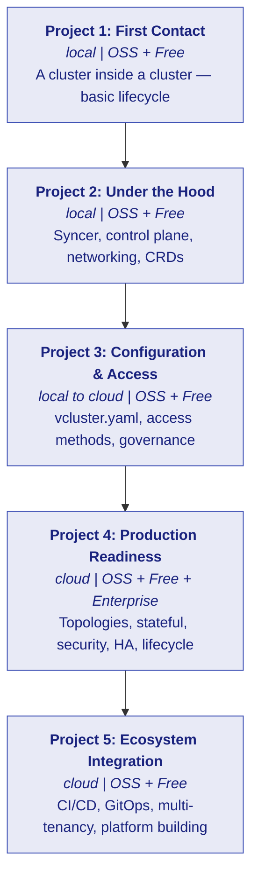
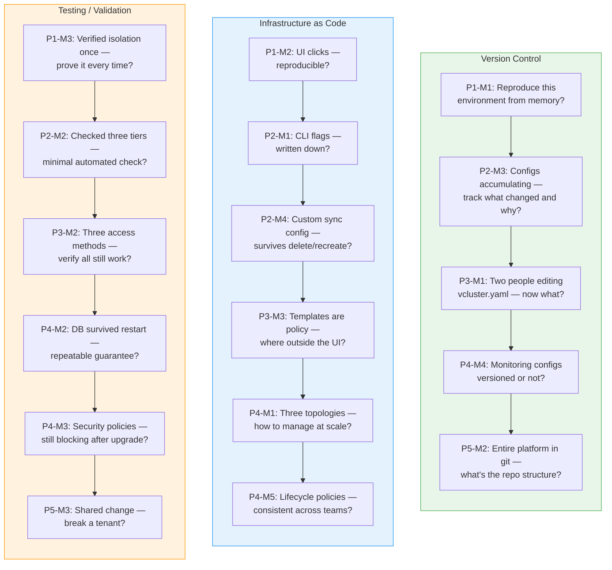
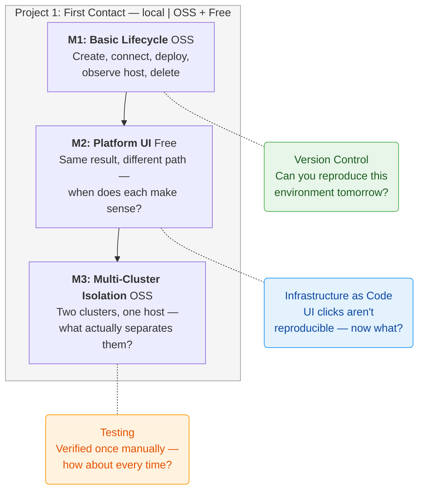
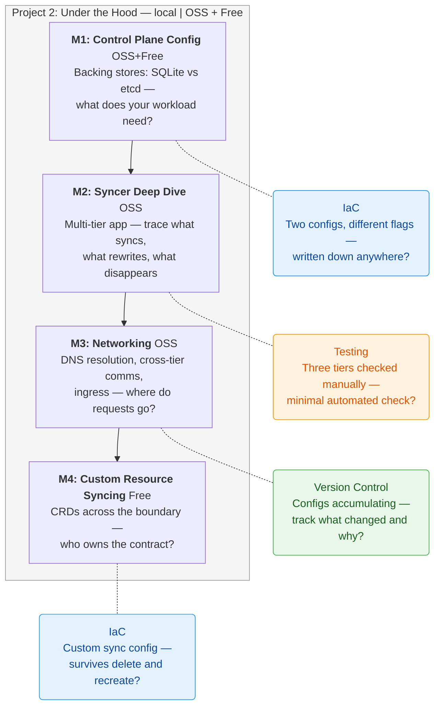
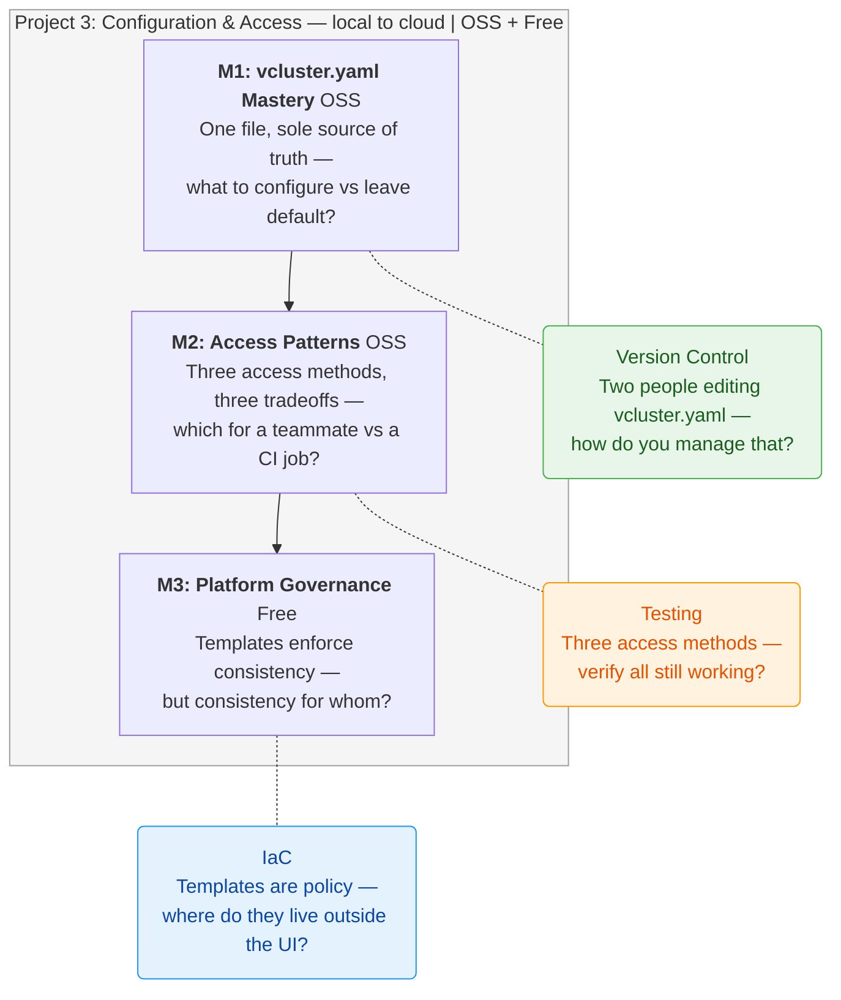
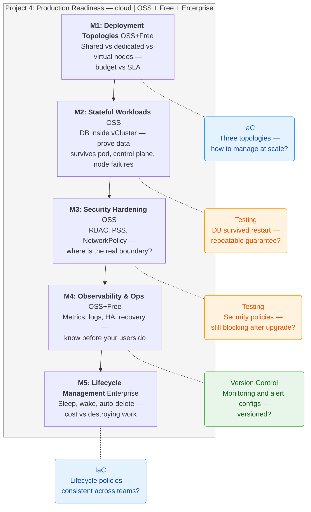
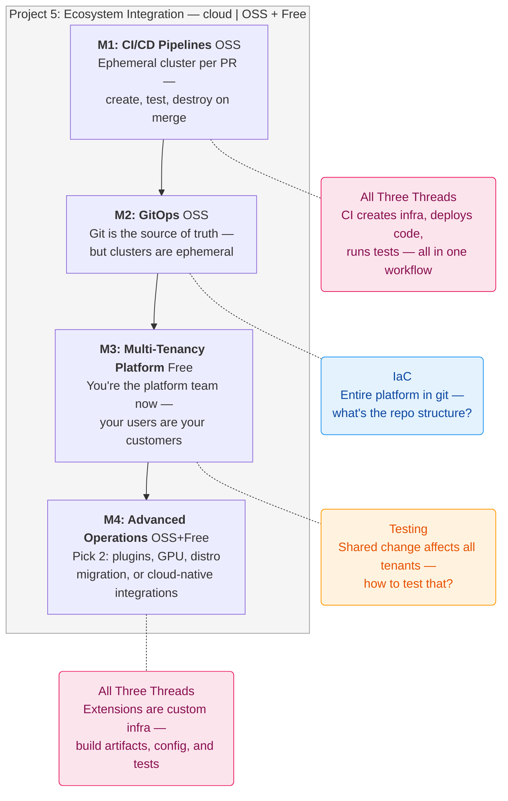

# vCluster Learning Roadmap

Mermaid diagrams optimized for Notion. Paste each fenced block into a Notion code block with language set to `mermaid`.

---

## Overview

---

## Lifecycle Threads — Full Progression

These three threads run parallel to the vCluster milestones. They are independent skills — you can learn vCluster without them, but production operators need all three.

---

## Project 1: First Contact

**Progress:** `○ M1` → `○ M2` → `○ M3`

---

## Project 2: Under the Hood

**Progress:** `○ M1` → `○ M2` → `○ M3` → `○ M4`

---

## Project 3: Configuration & Access

**Progress:** `○ M1` → `○ M2` → `○ M3`

---

## Project 4: Production Readiness

**Progress:** `○ M1` → `○ M2` → `○ M3` → `○ M4` → `○ M5`

---

## Project 5: Ecosystem Integration

**Progress:** `○ M1` → `○ M2` → `○ M3` → `○ M4`

---

## Legend

| Symbol | Meaning |
|--------|---------|
| `○` | Not started |
| `◐` | In progress |
| `●` | Complete |
| Green nodes | Version Control thread |
| Blue nodes | Infrastructure as Code thread |
| Orange nodes | Testing / Validation thread |
| Pink nodes | All three threads converge |
| Dotted lines | Lifecycle thread activates at this milestone |

---

## Progress Tracker

| Project | Milestones | Status |
|---------|-----------|--------|
| 1 — First Contact | M1 M2 M3 | `○ ○ ○` |
| 2 — Under the Hood | M1 M2 M3 M4 | `○ ○ ○ ○` |
| 3 — Configuration & Access | M1 M2 M3 | `○ ○ ○` |
| 4 — Production Readiness | M1 M2 M3 M4 M5 | `○ ○ ○ ○ ○` |
| 5 — Ecosystem Integration | M1 M2 M3 M4 | `○ ○ ○ ○` |

| Thread | Activations |
|--------|------------|
| Version Control | P1-M1 → P2-M3 → P3-M1 → P4-M4 → P5-M2 |
| Infrastructure as Code | P1-M2 → P2-M1 → P2-M4 → P3-M3 → P4-M1 → P4-M5 |
| Testing / Validation | P1-M3 → P2-M2 → P3-M2 → P4-M2 → P4-M3 → P5-M3 |